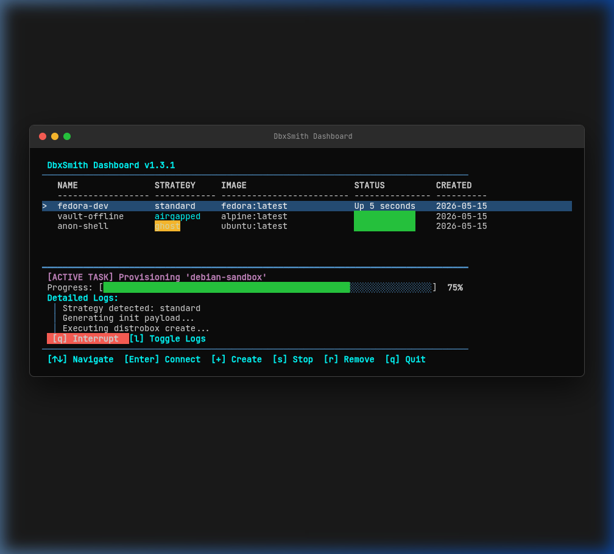
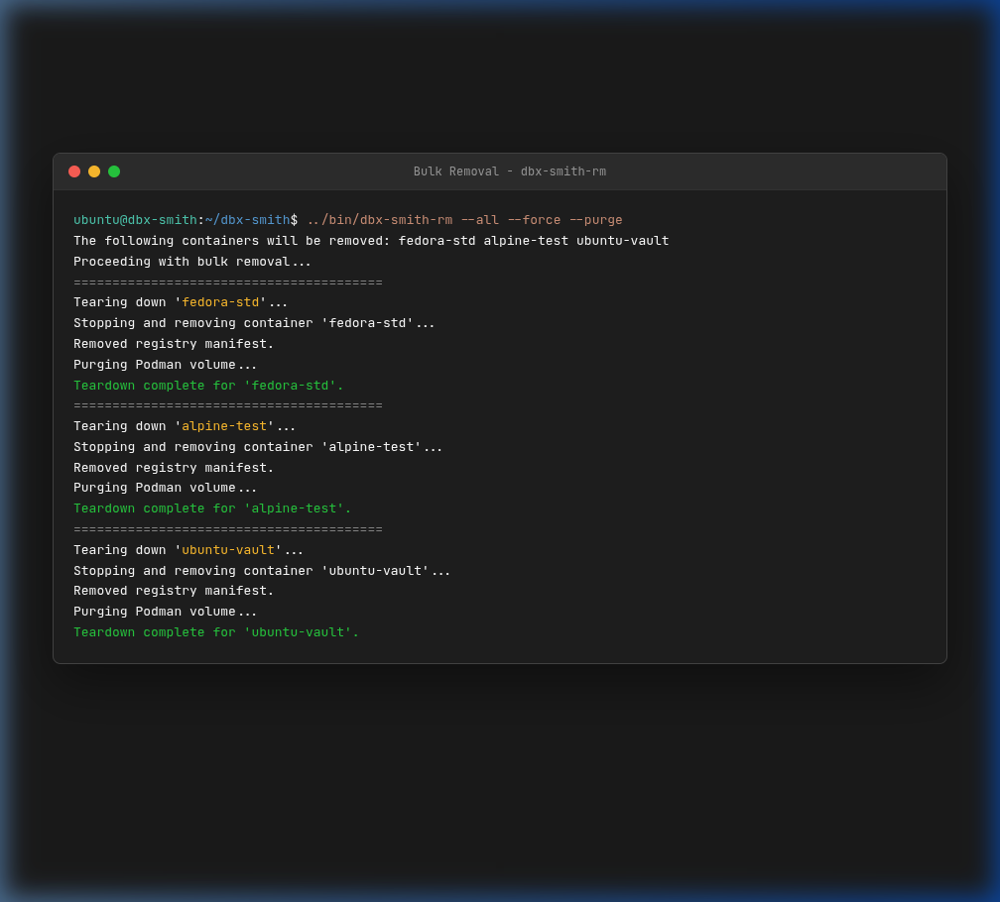

# ⚒️ DbxSmith

[](https://github.com/arijit1begins/dbx-smith/actions/workflows/pipeline.yml)
[](LICENSE)
[](https://arijit1begins.github.io/dbx-smith/docs/intro)

**DbxSmith** is a professional-grade provisioning, management, and orchestration suite built for **<a href="https://distrobox.it/" target="_blank" rel="noopener noreferrer">Distrobox</a>** and **<a href="https://podman.io/" target="_blank" rel="noopener noreferrer">Podman</a>**. It allows developers to forge isolated, high-performance container environments with strategic network control, a deterministic terminal TUI, and atomic bulk teardowns.

---

### 🌐 Quick Navigation
* 📖 **[Full Documentation Website →](https://arijit1begins.github.io/dbx-smith/docs/intro)**  
* 📰 **[Release & Engineering Blog →](https://arijit1begins.github.io/dbx-smith/blog)**  
* 📡 **[Blog RSS Feed →](https://arijit1begins.github.io/dbx-smith/blog/rss.xml)**

---



---

## 🚀 Key Features

*   **⚡ Async TUI Mission Control**: A pure Bash, high-performance asynchronous terminal dashboard (`dbx-smith dash`) with absolute zero-flicker rendering.
*   **🛡️ Host Identity Shielding (Ghost Boxes)**: ephemeral RAM-backed `tmpfs` over-mounting of `/home` to isolate host files and credentials perfectly.
*   **🌐 6 Strategic Isolation Levels**: Pre-configured strategies including `standard`, `airgapped`, `isolated-net`, `ghost`, and secure hybrids (`ghost-airgapped`, `ghost-isolated-net`).
*   **🎨 Visual Environment Anchoring**: Deterministic background colors and dynamic container-specific `PS1`/`PROMPT` injection based on the active container image.
*   **🗑️ Zero-Drift Atomic Teardowns**: Bulk destruction of containers, matching RAM directories, and virtual network NAT bridges with a single command (`--all`).

---

## 💻 Installation & Quick Start

Get up and running with a single command:

### 1. One-Step Installer
```bash
curl -fsSL https://raw.githubusercontent.com/arijit1begins/dbx-smith/main/install.sh | bash
```

*Alternatively, clone the repository locally and run:*
```bash
make install
```

### 2. Launching Mission Control
Forge and manage your containers instantly:
```bash
dbx-smith dash
```

---

## 🕹️ TUI Dashboard Controls

Launch the interactive dashboard with `dbx-smith dash` and navigate like a pro:

| Key / Hotkey | Action | Description |
| :---: | :--- | :--- |
| **`↑` / `↓` Arrow Keys** | **Navigate** | Browse through your local container environments. |
| **`Enter`** | **Connect** | Securely login and enter the selected container shell. |
| **`+`** | **Forge Wizard** | Start a guided creation wizard with full back-navigation support. |
| **`s`** | **Stop Box** | Stops the selected container container background processes cleanly. |
| **`r`** | **Destroy Box**| Atomically deletes the container and its ephemeral assets. |
| **`l`** | **Toggle Logs** | Displays real-time background provisioning and setup logs. |
| **`q`** | **Quit** | Gracefully exits the TUI dashboard back to your host terminal. |

---

## 🗑️ Bulk Atomic Destruction

Clean up all active containers, ephemeral home directories, and custom virtual network bridges with a single atomic command:

```bash
dbx-smith spin --remove-all
```



---

## 📊 Compatibility & Stability Matrix

DbxSmith guarantees **100% stable integration** across all 6 isolation strategies:

*   **💻 Host OS Support**: Any modern Linux distribution (Ubuntu, Fedora, Debian, Arch, Alpine, etc.)
    *   *Note: macOS and Windows are not supported.*
*   **📦 Runtime Engines**: Podman (Recommended), Distrobox, or Docker.
*   **🐧 Supported Guest Distros**: Alpine Linux, Arch Linux, Fedora, Ubuntu.

---

## 🧹 Clean Uninstallation

If you ever need to remove DbxSmith, clean up all system footprints atomically with:

```bash
dbx-smith-uninstall
```

---

*⚒️ Happy Forging!*
