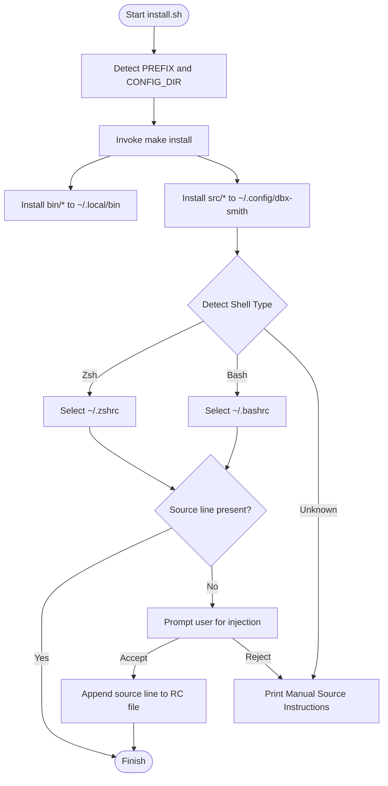
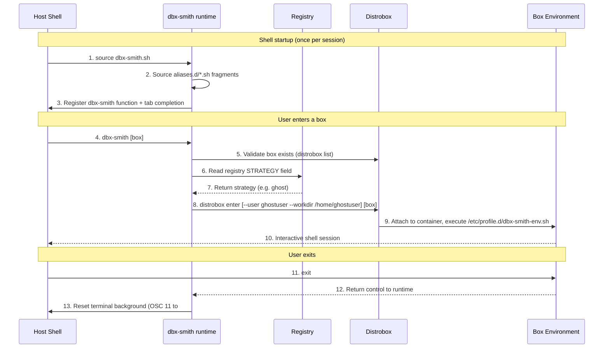
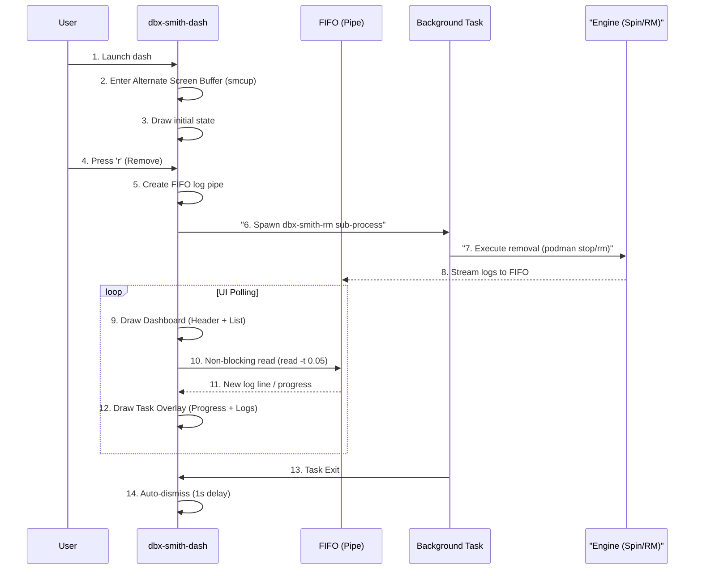
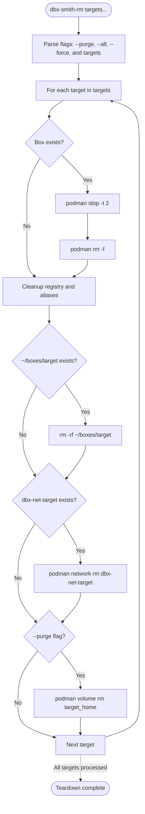

# Engineering Internals

This document is for developers contributing to or extending DbxSmith. It covers repository structure, the reasoning behind key engineering decisions, and detailed lifecycle diagrams for the runtime entry and teardown phases.

---

## I. Repository Structure

| Path | Category | Description |
| :--- | :--- | :--- |
| `install.sh` | **Entrypoint** | Quick-start installer and shell injector. |
| `bin/` | **Executables** | `dbx-smith-dash` (TUI), `dbx-smith-spin` (Spin), `dbx-smith-rm` (RM). |
| `src/` | **Runtime** | `dbx-smith.sh` — shell-integrated core logic, completions, alias loader. |
| `internal/` | **Metadata** | Design docs and templates (not shipped to users). |
| `docs/` | **Docs Site** | Docusaurus source for the public documentation. |
| `Makefile` | **Distributor** | Deterministic mapping of files to host paths. |

### Distribution paths (Makefile)

| Layer | Path | Content |
| :--- | :--- | :--- |
| **Execution** | `~/.local/bin/` | `dbx-smith-dash`, `dbx-smith-spin`, `dbx-smith-rm`, `dbx-smith-uninstall` |
| **Persistence** | `~/.config/dbx-smith/` | `dbx-smith.sh`, `registry/`, `aliases.d/` |
| **Shell** | `~/.bashrc` or `~/.zshrc` | `source ~/.config/dbx-smith/dbx-smith.sh` |

---

## II. Engineering Principles

<div className="admonition admonition-tip alert alert--success">
<div className="admonition-heading">
<h5>💡 IDEMPOTENCY</h5>
</div>
<div className="admonition-content">

Every script is safe to re-run. Existence checks before `mkdir`, `|| true` guards on network ops, and `command -v` checks before installing prevent duplication on partial failures.

</div>
</div>

### 2. Loose Coupling — The Fallback Pattern

The runtime (`dbx-smith.sh`) is loosely coupled with the registry. If the registry is deleted, it falls back to inspecting `/etc/passwd` inside the container for `ghostuser`. Tools should degrade gracefully, not crash.

<div className="admonition admonition-info alert alert--info">
<div className="admonition-heading">
<h5>📘 VISUAL DETERMINISM</h5>
</div>
<div className="admonition-content">

Terminal colors are derived from the image name via `cksum`, not randomly assigned. The same image always produces the same color — a security feature that prevents running commands in the wrong terminal window.

</div>
</div>

---

## III. The Entrypoint: `install.sh`



---

## IV. Runtime Entry Lifecycle (`dbx-smith`)

What happens every time you run `dbx-smith <box>` after provisioning.



---

## V. Interactive Mission Control (`dbx-smith-dash`)

The dashboard is a pure Bash TUI designed for sub-second responsiveness and zero flickering.




---

## VI. Destruction Lifecycle (`dbx-smith-rm`)




---

## VII. Advanced Engineering Details

For a deep dive into how DbxSmith handles shell hooks, cross-distro environment persistence, and the Ghost identity engine, see the [Shell Configuration Engineering](./shell_configuration.md) guide.

### 1. Zero-Escape Payload Injection (Base64 Tunnelling)

Passing complex scripts into `distrobox create --init-hooks` causes double shell evaluation — the host shell consumes `>>`, `$`, and `"` before they reach the container.

**Solution:** Encode the entire script as Base64 on the host. The host sees only alphanumeric characters. The container decodes and executes it fresh.

```bash
payload=$(printf "%s" "$script_content" | base64 | tr -d '\n')
hook="echo '$payload' | base64 -d | sh"
distrobox create --init-hooks "$hook" ...
```

### 2. The Freeze/Rebuild Airgap (The Phoenix Cycle)

Distrobox's first-run initializer needs internet access to install `sudo` and `mount` inside the guest. A container created with `--network none` immediately fails this step. Rootless Podman also makes it difficult to dynamically sever existing bridges from the host.

**Solution: The Phoenix Cycle**
Instead of fighting the engine, DbxSmith uses a **two-phase** provisioning flow:
1. **The Larva Phase**: Create a standard container with network access. Run `distrobox enter` once to trigger the guest package manager and install `iproute2` and `sudo`.
2. **The Chrysalis Phase**: Perform a `podman commit` to save the fully-provisioned guest state as a new, immutable image (`dbx-frozen-<name>`).
3. **The Phoenix Phase**: Atomically destroy the "Larva" container and re-create it using the "Frozen" image with the `--network none` flag explicitly set.

This guarantees that the box is physically airgapped from its first interactive second, without requiring complex host-side firewall rules.

### 3. Exact-Match Container Validation

Simple `grep "test"` on `distrobox list` matches `test-vault`, `test-old`, etc. — false positives that cause accidental deletions.

**Solution:** Use `awk` with field-level equality on column 3 (the NAME column):

```bash
distrobox list --no-color | awk -v name="$name" 'NR>1 && $3==name {found=1} END {exit !found}'
```

Used in `spin` (duplicate guard), `runtime` (existence check), and `rm` (target validation).

### 4. True Tmpfs Home Isolation (The Eclipse Hack)

Distrobox enforces a strict behavior: it *always* bind-mounts the host's default home directory (e.g., `/home/username`) into the container. Even if you pass a custom `--home ~/boxes/mybox` flag, Distrobox maps your root `/home` into the container, exposing SSH keys and `.bash_history`.

**The Naive Failure:**
If we attempt to forcibly remove it (`umount /home`) via an init-hook, Distrobox often crashes or throws permission errors because its internal bootstrapping relies on that path existing. We cannot fight Distrobox to *remove* the mount.

**Solution: The Eclipse (Over-mounting)**
Instead of removing it, DbxSmith uses a Linux trick: **Over-mounting**. When you mount a filesystem onto a directory that already contains files, the original contents become completely "eclipsed" or hidden underneath the new mount. 

DbxSmith injects a multi-stage `tmpfs` hack via `init-hooks` *before* the container shell starts:

```bash
# 1. Save the intended custom home directory
mkdir -p /tmp/save_home 
mount --bind "$HOME_BASE/$name" /tmp/save_home 

# 2. THE ECLIPSE: Obliterate host visibility by over-mounting /home entirely in RAM
mount -t tmpfs tmpfs /home 

# 3. Restore ONLY the custom home directory back into the empty RAM disk
mkdir -p "$HOME_BASE/$name"
mount --bind /tmp/save_home "$HOME_BASE/$name" 
umount /tmp/save_home
```

The new, empty `tmpfs` RAM disk is placed directly *on top* of `/home`. The host's `/home` still technically exists underneath, but it is now 100% inaccessible to any user or process inside the container. We bypass the hardcoded volume mapping without breaking the container lifecycle.

For **Ghost** strategies, it is even simpler: the `tmpfs` is mounted over `/home`, and then `/home/ghostuser` is created ephemerally inside the RAM disk. When the container halts, the RAM disk evaporates, guaranteeing zero traces are left on the host.

---

## VIII. Testing Framework Architecture

The DbxSmith testing suite (`test.sh`) is built on a **Decoupled Master/Slave Orchestrator Architecture**. It is designed to evaluate a massive cross-distribution matrix (Alpine, Arch, Fedora, Ubuntu) across every single isolation strategy dynamically, without hardcoding test cases.

### 1. Dynamic Plugin Discovery
The testing framework uses a plugin system to discover what to test:
- **Distro Plugins (`tests/distros/*.conf`)**: Each `.conf` file defines a `DISTRO_NAME` and `DISTRO_IMAGE`. The master orchestrator (`test.sh`) automatically iterates over all valid configurations. Adding Debian support to the test suite is as simple as dropping a `debian.conf` into this directory.
- **Strategy Plugins (`tests/strategies/*.sh`)**: The orchestrator scans this directory to discover the test logic for each strategy type.

### 2. Master / Slave Execution Model
Because isolation strategies permanently sever network connections or manipulate host routing, test assertions cannot be evaluated sequentially in a single environment.
- **The Master (`test.sh`)**: Runs on the host. It parses arguments (like `--full`), discovers plugins, and dispatches a separate "Slave" process for each Distro/Strategy combination. It acts purely as a lifecycle manager and report generator.
- **The Slave (`tests/common/slave_runner.sh`)**: The actual test execution boundary. The slave is responsible for provisioning the container using the specified strategy, executing the targeted assertions (`tests/strategies/<strategy_name>.sh`), and tearing the container down atomically. If a slave crashes or times out due to an infinite loop (Watchdog timeout), the Master intercepts the failure, kills the slave, and cleanly moves to the next matrix permutation.

### 3. Assertion Scoping (`_exec_in_box`)
The core testing assertion wrapper (`_exec_in_box` inside `tests/strategies/common_asserts.sh`) utilizes raw `podman exec` calls instead of the high-level `dbx-smith` entrypoint. 
This provides two major advantages:
1. **Unbuffered Speed**: Bypassing the wrapper logic reduces the assertion execution time by >60%.
2. **Dynamic Workdir Validation**: The wrapper intelligently evaluates the target strategy. If asserting against a `ghost` identity, it enforces `--workdir /home/ghostuser`. If standard, it maps `/home/ubuntu`. This guarantees that OCI runtime pathing errors are exposed explicitly during CI testing.
