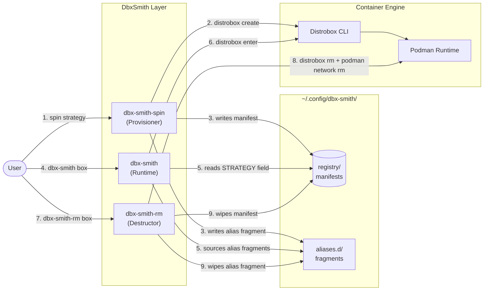
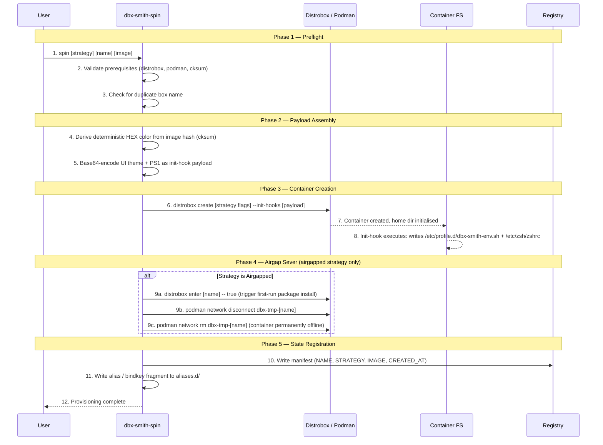

# Architecture & Engineering Deep-Dive

This document provides a detailed dissection of the **DbxSmith** suite, its internal mechanics, and how different components interact to forge isolated developer environments.

## System Overview

DbxSmith operates as a wrapper and orchestration layer over **[Distrobox](https://distrobox.it/)** and **[Podman](https://podman.io/)**. It adds a stateful registry, strategic provisioning, and shell-level UI integration.

There are three CLI tools, each owning a distinct phase of a box's lifecycle:

| Tool | Role | Key Actions |
| :--- | :--- | :--- |
| `dbx-smith-spin` | **Provisioner** | Reads strategy → creates container → writes registry manifest → generates alias fragment |
| `dbx-smith` (runtime) | **Entry Point** | Reads registry → enters correct box as correct user → resets terminal on exit |
| `dbx-smith-rm` | **Destructor** | Stops container → removes home dir, alias fragment, network bridge, registry manifest |

### Prerequisites

| Category | Tools | Purpose |
| :--- | :--- | :--- |
| **Engine** | `distrobox`, `podman` | Container creation and management |
| **Utilities** | `cksum` | Deterministic color derivation from image name |
| **Utilities** | `base64` | Zero-escape init-hook payload injection |
| **Utilities** | `awk`, `grep` | Registry parsing and container list filtering |




---

## The Provisioning Flow

When you run `dbx-smith-spin`, the following sequence occurs:



---

## Script Dissection

### 1. `bin/dbx-smith-spin` (The Architect)
This is the core provisioning logic.
- **Image Checksumming**: Uses `cksum` on the image name to generate a deterministic seed.
- **Theme Generation**: Converts the checksum seed into an RGB hex color. This ensures that every time you pull `ubuntu:latest`, your boxes have a consistent, distinct background color.
- **Isolation Logic**:
  - For **Airgapped**, it uses a **two-phase** approach. During `distrobox create`, it attaches a throwaway Podman network (`dbx-tmp-<name>`) so Distrobox's first-run package installer can reach the internet. Once `distrobox enter <name> -- true` completes, DbxSmith runs `podman network disconnect` and `podman network rm` to permanently destroy the bridge. The container is then left with zero network interfaces — isolation is achieved via namespace detachment, not a flag.

### 2. `src/dbx-smith.sh` (The Pulse)
The runtime core that lives in your shell.
- **Dynamic Sourcing**: It doesn't just store aliases; it sources them from `~/.config/dbx-smith/aliases.d/`. This allows you to "hot-swap" environment access without restarting your shell.
- **The Wrapper**: `dbx-smith()` function intercepts the container name and checks the registry before calling `distrobox enter`. For `ghost` boxes, it automatically appends `--user ghostuser`.

### 3. `bin/dbx-smith-rm` (The Reaper)
Ensures zero-drift teardowns.
- **Atomic Deletion**: It reads the registry to find exactly what was created (aliases, home directories, containers, network bridges) and wipes them in one pass.

---

## Strategic Visualizations

### Standard Strategy
*   **Visual**: A custom PS1 is injected with a cyan `(<name>)` distrobox marker prefix, e.g. `(devbox) user@host:~$`. The terminal background is set to a deterministic color derived from the image name hash. The prompt is **not** identical to the host — it is always clearly marked as a box.
*   **Networking**: Fully transparent — uses the host's default Podman bridge. The container can reach the internet and the host network.
*   **Home Dir**: Bind-mounted from the host (`$HOME` is the same inside and outside). Host `~/.ssh`, `~/.gnupg`, and all other directories are fully visible.
*   **Use Case**: Your daily driver. Node.js development, Go, etc., where you just need a different OS but same host files.

### Airgapped Strategy
*   **Visual**: A custom PS1 with a cyan `(<name>)` marker and a deterministic background color (derived from the image hash).
*   **Networking**: After provisioning, `ping` returns "Network is unreachable". The container's network namespace is fully detached — no bridge, no DNS, no external routing. This is achieved by destroying the temporary Podman network post-init, not by setting a flag at create time.
*   **Home Dir**: Located at `~/boxes/<name>`. Your host `~/.ssh`, `~/.gnupg`, and `.bash_history` are invisible from inside the container.
*   **Use Case**: Analyzing untrusted scripts, managing private keys, or "focused" offline coding.

### Ghost Strategy
*   **Visual**: A custom PS1 with a cyan `(<name>)` marker and a deterministic background color.
*   **Identity**: Running `whoami` returns `ghostuser`. Running `hostname` returns `ghost-shell`. Both the username and hostname differ from the host, but the network and home directory are still host-linked.
*   **Mechanism**: An init-hook runs `useradd -m ghostuser` inside the container (permanent within the container's `/etc/passwd`). The runtime (`dbx-smith.sh`) reads the registry and passes `--user ghostuser` to `distrobox enter` automatically.
*   **Home Dir**: Bind-mounted from the host `$HOME` — the ghost user operates in the same home directory as the host user.
*   **Use Case**: Testing permission-sensitive scripts or developing with a clean-slate identity without creating a real Linux user on the host.

### Isolated-Net Strategy
*   **Visual**: A custom PS1 with a cyan `(<name>)` marker and a deterministic background color.
*   **Networking**: The container's network namespace is unshared from the host (`--unshare-netns`) and attached to a **dedicated Podman NAT bridge** (`dbx-net-<name>`). This gives the container outbound internet access via NAT while keeping it off the host's default bridge network. The bridge persists and is cleaned up by `dbx-smith-rm`.
*   **Home Dir**: Located at `~/boxes/<name>`. Host `~/.ssh` and other sensitive directories are not accessible from inside.
*   **Use Case**: Developing microservices or web apps that require a dedicated, non-clashing network segment or a reproducible private IP.

---

## The Registry

The registry is the **single source of truth** that ties all three tools together. Without it, DbxSmith degrades to a thin alias for raw `distrobox` — no strategy-aware entry, no targeted teardown, no deterministic state.

**Path**: `~/.config/dbx-smith/registry/<box_name>.conf`

```bash
# Example Manifest
NAME=vault
STRATEGY=airgapped
IMAGE=alpine:latest
CREATED_AT=2026-04-21T00:15:00Z
```

### What each field drives

| Field | Written by | Read by | Purpose |
| :--- | :--- | :--- | :--- |
| `NAME` | `spin` | `rm` | Exact match key used by `rm` to target the right container and its associated home dir, alias fragment, and network bridge. |
| `STRATEGY` | `spin` | `runtime` | Tells `dbx-smith` *how* to enter the box. `ghost` → appends `--user ghostuser`. Other strategies → standard entry. |
| `IMAGE` | `spin` | — | Audit trail. Lets you inspect what image a running box was built from without querying Podman. |
| `CREATED_AT` | `spin` | — | Timestamp for auditing and sorting when you have many boxes. |

### What breaks without it

- **Runtime (`dbx-smith`)**: Falls back to a heuristic — checks `/etc/passwd` inside the container for `ghostuser`. If the registry is missing, `ghost` boxes may be entered as the wrong user.
- **Teardown (`dbx-smith-rm`)**: Cannot know whether the box had an isolated home directory (`~/boxes/<name>`) or a dedicated network bridge (`dbx-net-<name>`). Those artifacts will be **orphaned** on the filesystem.
- **Duplicate guard (`spin`)**: `spin` reads the registry to prevent re-provisioning a box that already exists by name.

---

## Summary of Interaction

| Feature | `spin` | `runtime` | `rm` |
| :--- | :---: | :---: | :---: |
| Writes Registry | ✅ | ❌ | ❌ |
| Reads Registry | ✅ | ✅ | ✅ |
| Deletes Registry | ❌ | ❌ | ✅ |
| Injects UI | ✅ | ❌ | ❌ |
| Loads Aliases | ❌ | ✅ | ❌ |
