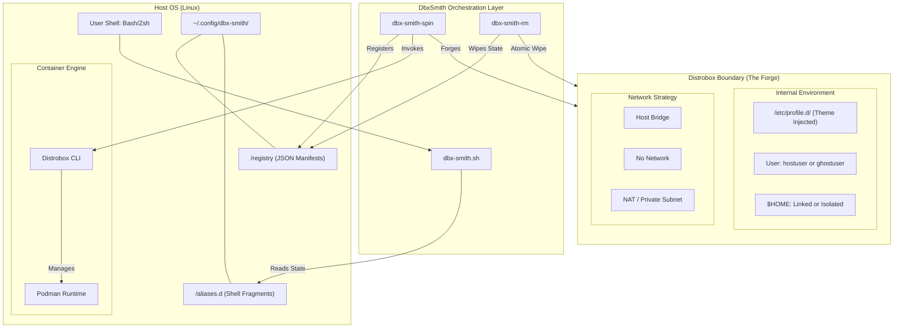
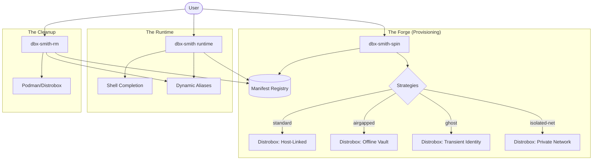
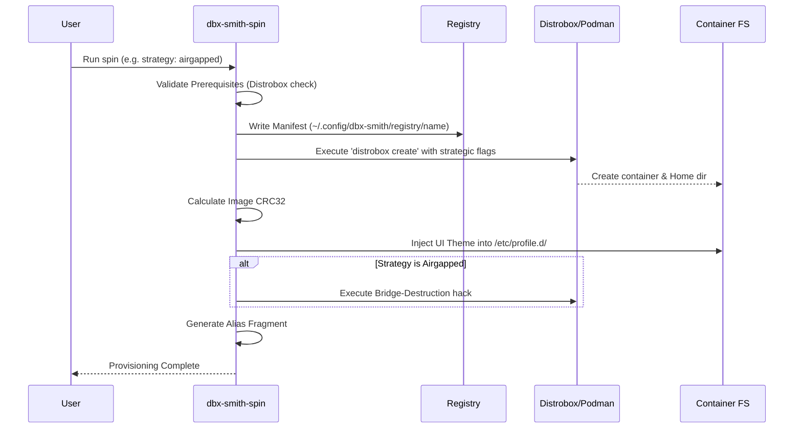

# Architecture & Engineering Deep-Dive

This document provides a detailed dissection of the **DbxSmith** suite, its internal mechanics, and how different components interact to forge isolated developer environments.

## System Overview

DbxSmith operates as a wrapper and orchestration layer over **Distrobox** and **Podman**. It adds a stateful registry, strategic provisioning, and shell-level UI integration.

## Infrastructure & Boundary Map

The following diagram illustrates the boundaries between the Host system, the DbxSmith orchestration layer, and the provisioned environments.




### High-Level Component Map



---

## The Provisioning Flow

When you run `dbx-smith-spin`, the following sequence occurs:



---

## Script Dissection

### 1. `bin/dbx-smith-spin` (The Architect)
This is the core provisioning logic.
- **Image Checksumming**: Uses `cksum` on the image name to generate a deterministic seed.
- **Theme Generation**: Converts the checksum seed into HSL values. This ensures that every time you pull `ubuntu:latest`, your "standard" boxes have consistent, distinct colors.
- **Isolation Logic**: 
  - For **Airgapped**, it uses `--additional-flags "--network=none"` during create, but since Distrobox often mounts host network files, it explicitly wipes `/etc/resolv.conf` and `/etc/hosts` fragments inside the box post-init.

### 2. `src/dbx-smith.sh` (The Pulse)
The runtime core that lives in your shell.
- **Dynamic Sourcing**: It doesn't just store aliases; it sources them from `~/.config/dbx-smith/aliases.d/`. This allows you to "hot-swap" environment access without restarting your shell.
- **The Wrapper**: `dbx-smith()` function intercepts the container name and checks the registry before calling `distrobox enter`.

### 3. `bin/dbx-smith-rm` (The Reaper)
Ensures zero-drift teardowns.
- **Atomic Deletion**: It reads the registry to find exactly what was created (aliases, home directories, containers) and wipes them in one pass.

---

## Strategic Visualizations

### Standard Strategy
*   **Visual**: Terminal colors match the host. Identical prompt appearance.
*   **Networking**: Fully transparent.
*   **Use Case**: Your daily driver. Node.js development, Go, etc., where you just need a different OS but same host files.

### Airgapped Strategy
*   **Visual**: Distinct, often muted or "alert" colors (e.g., deep red or gray background).
*   **Networking**: `ping` returns "Network is unreachable". `/etc/resolv.conf` is empty.
*   **Home Dir**: Located at `~/dbx-homes/<name>`. Your host `.ssh` and `.bash_history` are invisible.
*   **Use Case**: Analyzing untrusted scripts, managing private keys, or "focused" offline coding.

### Ghost Strategy
*   **Visual**: Usually high-contrast or unique themes to remind you that you are a "ghost".
*   **Identity**: Running `whoami` returns `ghostuser`.
*   **Use Case**: Testing permission-sensitive scripts or developing with a clean-slate user identity without creating a real Linux user on the host.

### Isolated-Net Strategy
*   **Visual**: Network-themed color accents (e.g., blue or cyan).
*   **Networking**: Isolated bridge with a private subnet. Host is reachable, but the container cannot be reached by other containers on the host bridge.
*   **Home Dir**: Usually isolated at `~/dbx-homes/<name>`.
*   **Use Case**: Developing microservices or web apps that require a dedicated, non-clashing IP address or a private network segment.

---

## Database Schema (The Registry)

DbxSmith avoids heavy databases. It uses a **Key-Value Flatfile** system:

**Path**: `~/.config/dbx-smith/registry/<box_name>`

```bash
# Example Manifest
BOX_NAME="vault"
STRATEGY="airgapped"
IMAGE="alpine:latest"
HOME_DIR="/home/user/dbx-homes/vault"
THEME_SEED="38472910"
CREATED_AT="2026-04-21T00:15:00Z"
```

---

## Summary of Interaction

| Feature | `spin` | `runtime` | `rm` |
| :--- | :---: | :---: | :---: |
| Writes Registry | ✅ | ❌ | ❌ |
| Reads Registry | ✅ | ✅ | ✅ |
| Deletes Registry | ❌ | ❌ | ✅ |
| Injects UI | ✅ | ❌ | ❌ |
| Loads Aliases | ❌ | ✅ | ❌ |
