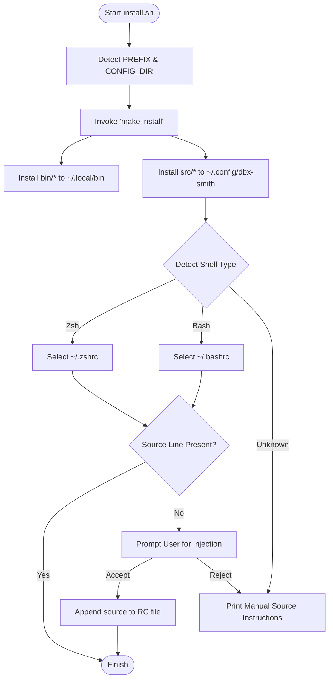
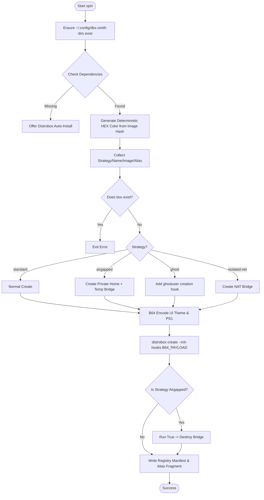
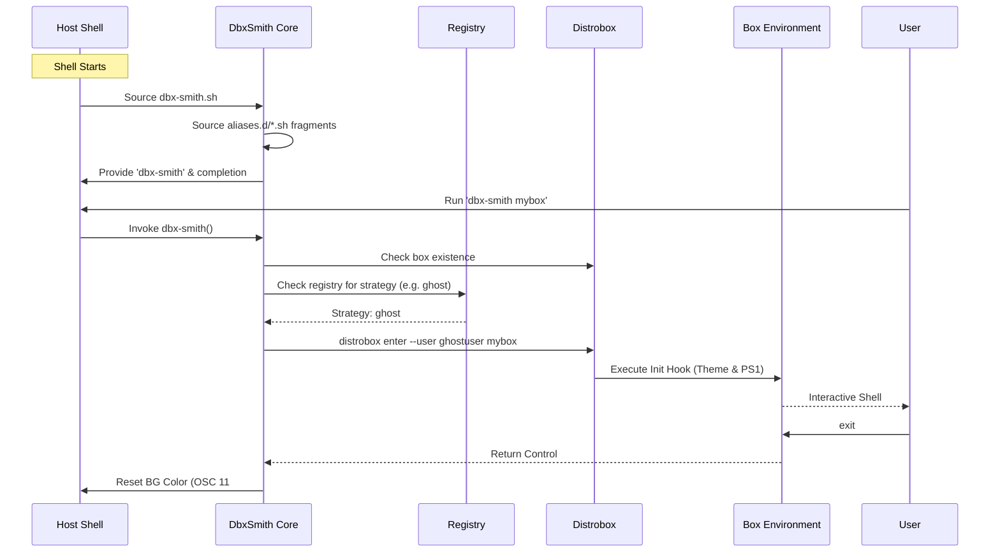
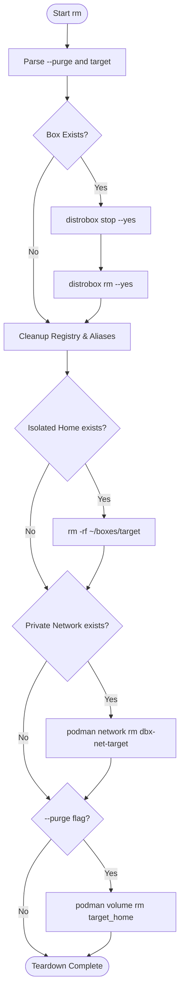

# 📖 The Developer's Bible: DbxSmith Internals

This document serves as the definitive guide to the internal mechanics, engineering patterns, and logical flows of the **DbxSmith** suite. It is designed to take a developer from a high-level structural understanding to a deep-dive into the low-level implementation "secrets."

---

## 🏗 I. Structural Blueprint

### 1. Repository Hierarchy
DbxSmith is organized to strictly separate installation scripts, runtime core, and internal templates.

| Path | Category | Description |
| :--- | :--- | :--- |
| `install.sh` | **Entrypoint** | The quick-start installer and shell injector. |
| `bin/` | **Executables** | Primary CLI tools: `dbx-smith-spin` and `dbx-smith-rm`. |
| `src/` | **Runtime** | `dbx-smith.sh` — The shell-integrated core logic and completions. |
| `internal/` | **Metadata** | Design docs, implementation plans, and branding templates. |
| `docs/` | **Docs Site** | The Docusaurus source code for the public documentation. |
| `Makefile` | **Distributor** | Handles the deterministic mapping of files to the host system. |

### 2. Distribution Strategy (The Makefile)
The `Makefile` enforces a standard Linux distribution pattern:
-   **Execution Layer**: Binaries are installed to `~/.local/bin/` to be available in the user's `$PATH`.
-   **Persistence Layer**: The runtime core and all stateful subdirectories (`registry/`, `aliases.d/`) are installed to `~/.config/dbx-smith/`.
-   **Shell Integration**: The user is required to source `~/.config/dbx-smith/dbx-smith.sh` to activate the environment.

---

## 🛠 II. Engineering Foundation (Patterns & Rationale)

DbxSmith is built on several key engineering principles that differentiate it from raw Distrobox usage.

### 1. Idempotency (The "Self-Healing" Pattern)
Every script is designed to be **re-runnable**. 
-   **Rationale**: Developer environments are prone to partial failures. If a provisioning step fails halfway, re-running the script should fix the missing pieces without duplicating existing ones (e.g., checking for existing directories before `mkdir`).

### 2. Loose Coupling (The "Fallback" Pattern)
The runtime core (`dbx-smith.sh`) is loosely coupled with the state registry.
-   **Rationale**: Even if the registry config in `~/.config` is deleted, the core logic should still be able to enter a box by using heuristics (like checking `/etc/passwd` for specific users).

### 3. Visual Determinism (Deterministic UI)
Colors are not assigned randomly; they are derived from the image name.
-   **Rationale**: Visual context is a security feature. If a developer is in an "Airgapped" Ubuntu box, it should *always* look the same, preventing accidental execution of commands in the wrong environment.

---

## 🧩 III. Core Primitives & Prerequisites

Before any logic executes, DbxSmith validates the existence of its "Engine" and "Tools".

-   **The Engine**: `distrobox` and `podman`.
-   **The Utilities**: 
    -   `cksum`: For deterministic UI hashing.
    -   `base64`: For zero-escape payload injection.
    -   `awk/grep`: For registry parsing and shell-agnostic list filtering.

---

## 🚪 IV. The Entrypoint: `install.sh`

The `install.sh` script is the first point of contact for a user. It is responsible for bridging the gap between the repository and the user's shell environment.

### Installation Flow


---

## 🚀 V. Lifecycle Phase 1: Provisioning (`dbx-smith-spin`)

The `spin` utility is the **Factory** of the suite. Its primary role is to translate high-level strategies into raw Distrobox and Podman flags.

### Provisioning Flow


---

## ⚡ VI. Lifecycle Phase 2: Runtime Core (`dbx-smith.sh`)

The runtime core is the **Bridge** between your host shell and your boxes.

### Runtime Execution Flow


---

## 🧹 VII. Lifecycle Phase 3: Destruction (`dbx-smith-rm`)

The `rm` utility is the **Reaper**, ensuring atomic teardowns.

### Destruction Flow


---

## 🤫 VIII. Advanced Engineering Secrets

### 1. Zero-Escape Payload Injection
To avoid the "escaping hell" of passing complex shell scripts into `distrobox create` flags, DbxSmith uses **Base64 Tunnelling**:
```bash
payload=$(echo "$script" | base64)
hook="echo $payload | base64 -d | sh"
```
This ensures that the exact script content—including quotes and newlines—arrives inside the container perfectly intact.

### 2. The Bridge-Destruction Hack
For `airgapped` environments, DbxSmith allows internet access *only* during the first 60 seconds of provisioning. Once Distrobox finishes its first-run package installation, DbxSmith **destroys the bridge** and deletes the network definition from Podman, ensuring the container can never reach the outside world again.
