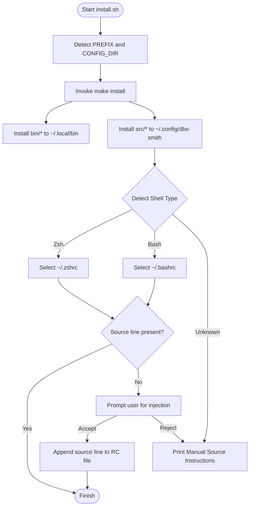
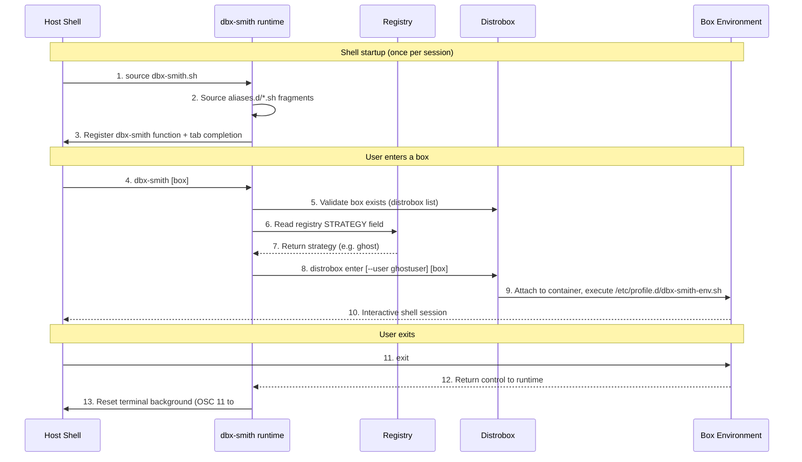
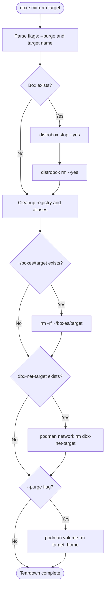

# Engineering Internals

This document is for developers contributing to or extending DbxSmith. It covers repository structure, the reasoning behind key engineering decisions, and detailed lifecycle diagrams for the runtime entry and teardown phases.

---

## I. Repository Structure

| Path | Category | Description |
| :--- | :--- | :--- |
| `install.sh` | **Entrypoint** | Quick-start installer and shell injector. |
| `bin/` | **Executables** | CLI tools: `dbx-smith-spin`, `dbx-smith-rm`, and `dbx-smith-uninstall`. |
| `src/` | **Runtime** | `dbx-smith.sh` — shell-integrated core logic, completions, alias loader. |
| `internal/` | **Metadata** | Design docs and templates (not shipped to users). |
| `docs/` | **Docs Site** | Docusaurus source for the public documentation. |
| `Makefile` | **Distributor** | Deterministic mapping of files to host paths. |

### Distribution paths (Makefile)

| Layer | Path | Content |
| :--- | :--- | :--- |
| **Execution** | `~/.local/bin/` | `dbx-smith-spin`, `dbx-smith-rm`, `dbx-smith-uninstall` |
| **Persistence** | `~/.config/dbx-smith/` | `dbx-smith.sh`, `registry/`, `aliases.d/` |
| **Shell** | `~/.bashrc` or `~/.zshrc` | `source ~/.config/dbx-smith/dbx-smith.sh` |

---

## II. Engineering Principles

### 1. Idempotency — The Self-Healing Pattern

Every script is safe to re-run. Existence checks before `mkdir`, `|| true` guards on network ops, and `command -v` checks before installing prevent duplication on partial failures.

### 2. Loose Coupling — The Fallback Pattern

The runtime (`dbx-smith.sh`) is loosely coupled with the registry. If the registry is deleted, it falls back to inspecting `/etc/passwd` inside the container for `ghostuser`. Tools should degrade gracefully, not crash.

### 3. Visual Determinism — Deterministic UI

Terminal colors are derived from the image name via `cksum`, not randomly assigned. The same image always produces the same color — a security feature that prevents running commands in the wrong terminal window.

---

## III. The Entrypoint: `install.sh`



---

## IV. Runtime Entry Lifecycle (`dbx-smith`)

What happens every time you run `dbx-smith <box>` after provisioning.



---

## V. Destruction Lifecycle (`dbx-smith-rm`)



---

## VI. Advanced Engineering Details

### 1. Zero-Escape Payload Injection (Base64 Tunnelling)

Passing complex scripts into `distrobox create --init-hooks` causes double shell evaluation — the host shell consumes `>>`, `$`, and `"` before they reach the container.

**Solution:** Encode the entire script as Base64 on the host. The host sees only alphanumeric characters. The container decodes and executes it fresh.

```bash
payload=$(printf "%s" "$script_content" | base64 | tr -d '\n')
hook="echo '$payload' | base64 -d | sh"
distrobox create --init-hooks "$hook" ...
```

### 2. The Two-Phase Airgap

Distrobox's first-run initializer needs internet access to install `sudo` and `mount` inside the guest. A container created with `--network none` immediately fails this step.

**Solution:** Provision with a throwaway network, bootstrap, then destroy it permanently.

```bash
podman network create dbx-tmp-<name>
distrobox create --additional-flags "--network dbx-tmp-<name>" ...
distrobox enter <name> -- true          # triggers first-run
podman network disconnect dbx-tmp-<name> <name>
podman network rm dbx-tmp-<name>        # bridge permanently deleted
```

Isolation is **event-driven** (process completion), not time-based.

### 3. Exact-Match Container Validation

Simple `grep "test"` on `distrobox list` matches `test-vault`, `test-old`, etc. — false positives that cause accidental deletions.

**Solution:** Use `awk` with field-level equality on column 3 (the NAME column):

```bash
distrobox list --no-color | awk -v name="$name" 'NR>1 && $3==name {found=1} END {exit !found}'
```

Used in `spin` (duplicate guard), `runtime` (existence check), and `rm` (target validation).
